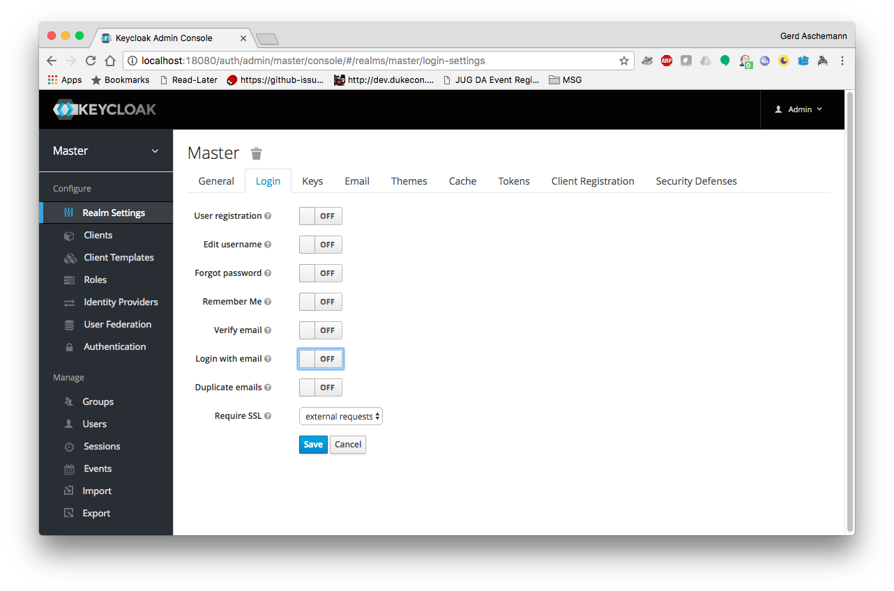
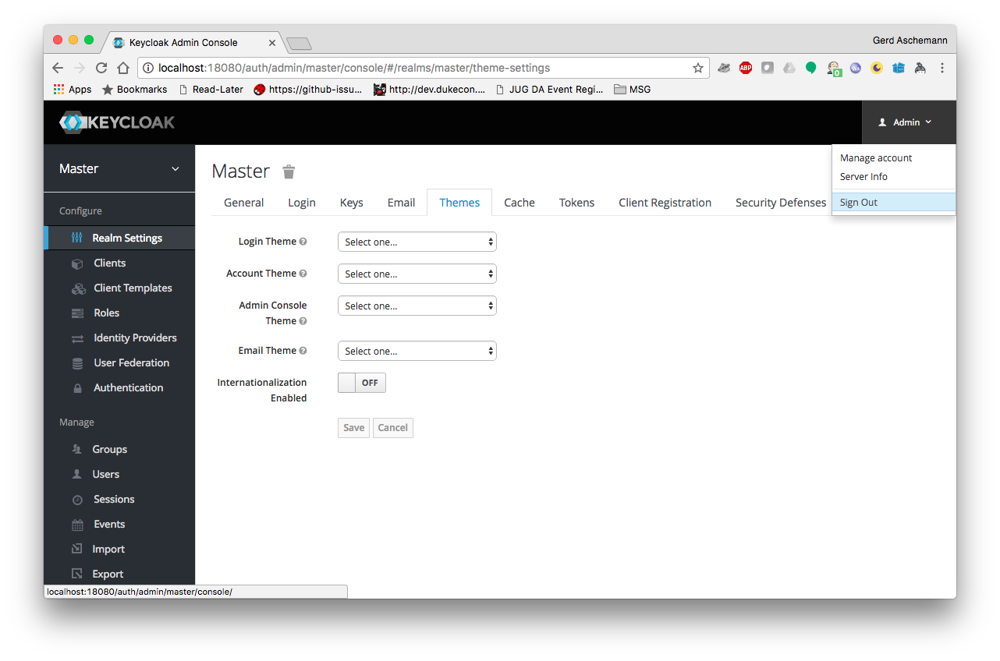
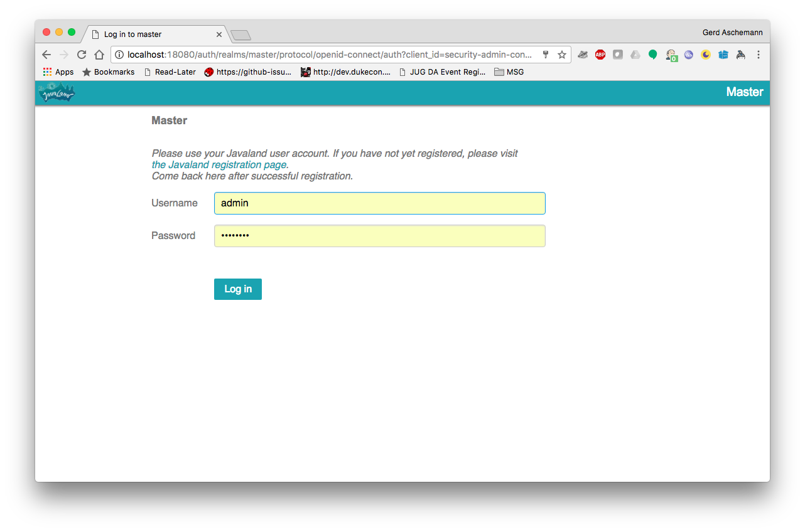

# DukeCon / Javaland KeyCloak Docker

## Introduction

TBD

## Add Theme(s)

If you would like to see a new theme, e.g., for a new conference, just go to the 
`src/main/docker/themes` folder and follow the appropriate instructions from the
[KeyCloak documentation](https://keycloak.gitbooks.io/documentation/server_development/topics/themes.html).

## Testing

If you want to test the provided DukeCon/Javaland (or you new) themes, perform the following steps:

### Build Docker test image

```bash
mvn clean package -Plocaltest
```

### Run Docker test image

```bash
docker run -ti --rm \
  --name keycloak-test \
  -e KEYCLOAK_USER=admin \
  -e KEYCLOAK_PASSWORD=admin123 \
  -p 18080:8080 dukecon/dukecon-keycloak:1.1-SNAPSHOT
```

Wait a second for the Docker container to come up!

### Connect to Admin interface

* Login to KeyCloak Admin Console on http://localhost:18080/auth/admin
* Use the credentials set as Environment variables from the run step


### Configure KeyCloak

* Select the _master_ realm (this is by default the only realm)
* Switch to _Login_ tab 
** Set all options to _off_
** Save the settings!

* Switch to _Themes_ tab
** Select _javaland_ (or any other theme) as _Login Theme_


** Save the settings!

### Test new settings

* Sign out

* You should see your new Login page


## KeyCloak Admin Cheat Sheet

### Docker Exec

If you want to perform some operations with the `kcadm.sh` script, e.g., bulk deletes of users,
you could connect to the running docker container and start a shell. 

```bash
docker exec -ti keycloak /bin/bash
```

In the shell session you may switch to the JBoss `bin` directory (all subsequent commands are
executed from there).

```bash
cd /opt/jboss/keycloak/bin
```

### Delete all users

I recommend to set an environment variable to refer to the realm you are working on

```bash
export REALM="javaland"
```

First you have to list all users

```bash
./kcadm.sh get users --format csv --noquotes -l 10000 -r ${REALM} > /tmp/${REALM}-users
```

Then I would recommend to create a batch file with all user endpoints

```bash
awk -F, '{print "users/"$1}' /tmp/${REALM}-users > /tmp/${REALM}-users-ids 
```

Finally you could delete all of them in a loop

```bash
for i in `cat /tmp/${REALM}-users-ids`; do ./kcadm.sh delete $i -r ${REALM}; echo $i; done
```

